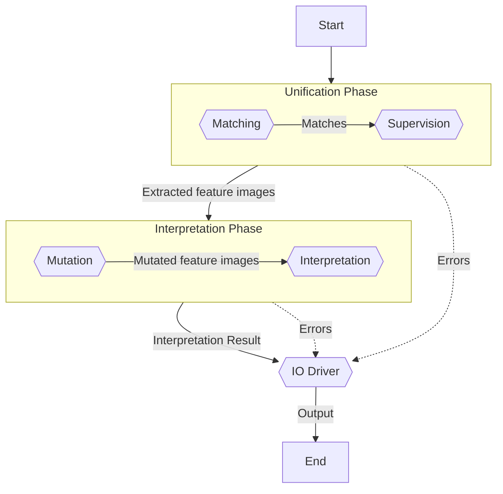

# Basics

```mermaid
graph TB
    start_node[Start];
    end_node[End];
    subgraph unification_phase[Unification Phase]
        direction LR
        matching{{Matching}} -- "Matches" --> supervision{{Supervision}};
    end
    subgraph interpretation_phase[Interpretation Phase]
        direction LR
        mutation{{Mutation}} -- "Mutated feature images" --> interpretation{{Interpretation}};
    end
    io_driver{{IO Driver}};
    
    start_node --> unification_phase;
    
    unification_phase -- "Extracted feature images" --> interpretation_phase;
    
    interpretation_phase -- "Interpretation Result" --> io_driver;
    
    unification_phase & interpretation_phase -. "Errors" .-> io_driver;
    io_driver -- "Output" --> end_node;
```