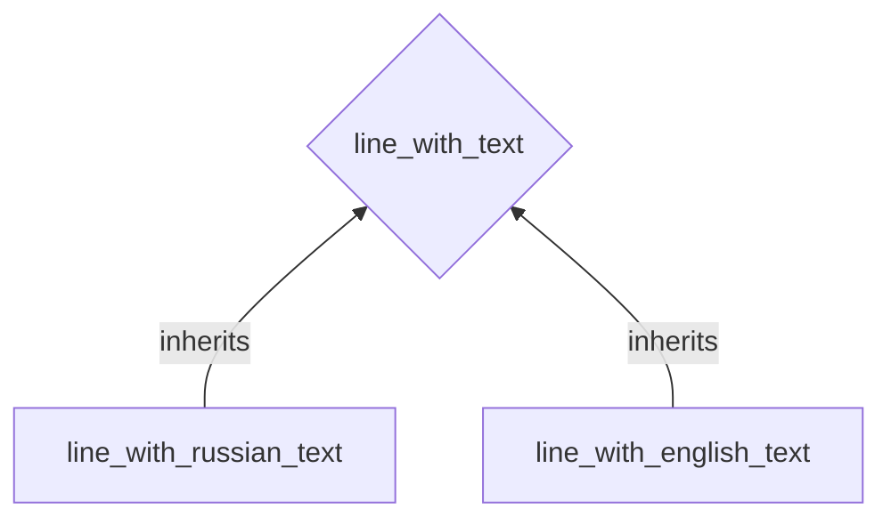

# Examples

## Retrieving Information from a Driver's License Photo

In this example, we'll showcase how OfficialEye simplifies the extraction of information from a driver's license photo, even when faced with challenges such as low image quality, rotation, zoom, and varying angles.

### Template creation

Start by obtaining a properly positioned and high-quality image of a driver's license, which will serve as the template for OfficialEye. This template image acts as the reference point for recognizing similar documents in other images.

For demonstration purposes, let's use the following scan of a driver's license.

???+ tip "Template image"
    { loading=lazy }

Next, we initialize a new template configuration file using the following command.

```shell
officialeye create driver_license_ru.yml driver_license_ru.jpg
```

This command generates a `driver_license_ru.yml` file initialized with default values, based on the provided `driver_license_template.jpg` template image file. We open this file in a text editor with syntax highlighting for convenient customization.

### Template configuration

In the generated `driver_license_ru.yml` file, we now need to customize default configuration values in the following sections.

#### ID and Name

* We change the `id` field to an alphanumeric and unique identifier for the template, in this case `driver_license_ru`.
* (Optional) We modify the name field, for example, to `Driver License RU`, to indicate the template's association with a Russian driver's license.

```yaml title="driver_license_ru.yml (fragment)"
id: "driver_license_ru"
name: "Driver License RU"
```

#### Keypoints

Keypoints are rectangular regions that should exist in most documents of the specified kind, serving as reference points to establish correspondences between the positions in the input image and the template image. Careful selection of keypoints is essential for accurate and reliable document analysis. In the present example, it makes sense to define the following keypoints.

```yaml title="driver_license_ru.yml (fragment)"
keypoints:
  title: # (1)!
    x: 453 # (2)!
    y: 55 # (3)!
    w: 792 # (4)!
    h: 70 # (5)!
    matches: # (6)!
      min: 15 # (7)!
      max: 50 # (8)!
  rus_symbol:
    x: 138
    y: 33
    w: 187
    h: 109
    matches:
      min: 2
      max: 30
  heading_bar:
    x: 441
    y: 154
    w: 96
    h: 610
    matches:
      min: 5
      max: 30
  heading_4b:
    x: 802
    y: 432
    w: 67
    h: 49
    matches:
      min: 1
      max: 10
  heading_67:
    x: 58
    y: 663
    w: 51
    h: 106
    matches:
      min: 3
      max: 10
  b_b1:
    x: 531
    y: 681
    w: 141
    h: 78
    matches:
      min: 0
      max: 20
```

1. `title` is the name of the keypoint.
2. The x-coordinate of the top left corner of the rectangle (measured in pixels). Remember that the origin is located in the top left corner of the image. In other words, the x-axis points to the right, and the y-axis points down (not up!).
3. The y-coordinate of the top left corner of the rectangle (measured in pixels). Remember that the origin is located in the top left corner of the image. In other words, the x-axis points to the right, and the y-axis points down (not up!).
4. Width of the rectangle (measured in pixels).
5. Height of the rectangle (measured in pixels).
6. A match is a correspondence between a point in the template image and a point in the input image.
7. Minimum amount of matches that should be identified within this keypoint's region when analyzing an image.
8. Maximum amount of matches that should be identified within this keypoint's region when analyzing an image.

!!! question "Not familiar with the above syntax?"
    Above we have used `YAML` syntax. If you are not familiar with it, read [this page](./getting-started/yaml-basics.md).

Each keypoint should have a unique name and is defined by coordinates, width and height. This data can be easily collected by selecting the region of interest in any image editing program. Note that the origin is always located in the top left corner of the image. In other words, the x-axis points to the right, while the y-axis points down (not up!). A keypoint should also have a minimum and maximum number of matches defined. A match is a correspondence between a point in the template image and a point in the input image. Intuitively, the bounds on the match count allow us to specify the importance of a keypoint. For example, by setting the `matches.min` value of the `title` keypoint above to 15, we have explained that it is crucial to find at least 15 matches between that region and the input image. In case there are fewer matches, OfficialEye will conclude that the input image is not a valid driver's license photo. The upper bound on the match count is useful for preventing possible performance issues caused by an enormous number of matches.

!!! note
    Having a sufficient number of keypoints, ideally distributed across different regions of the template image, enhances the tool's ability to infer the document's orientation accurately.

The keypoint configuration can be visualized by running the following command.

```shell
officialeye show driver_license_ru.yml --hide-features
```

???+ tip "Visualization of the template's keypoints"
    { loading=lazy }

#### Features

Features are rectangular regions located in the template image and containing specific information of interest, such as text within a document. Similar to keypoints, features are defined by providing the x, y coordinates of the top left corner of the rectangle, together with a width and height. In addition to this, every feature may belong to a specific feature class. Its name can be specified via the `class` field. In the present example, it makes sense to define the following features describing all the information of interest located in the driver's license template image.

```yaml title="driver_license_ru.yml (fragment)"
features:
  last_name_ru: # (1)!
    x: 525
    y: 160
    w: 600
    h: 45
    class: line_with_russian_text # (2)! 
  last_name_en:
    x: 525
    y: 200
    w: 600
    h: 35
    class: line_with_english_text
  name_ru:
    x: 525
    y: 235
    w: 600
    h: 45
    class: line_with_russian_text
  name_en:
    x: 525
    y: 275
    w: 600
    h: 35
    class: line_with_english_text
  birthday:
    x: 525
    y: 310
    w: 600
    h: 45
    class: line_with_english_text
  place_of_birth_ru:
    x: 525
    y: 350
    w: 600
    h: 40
    class: line_with_russian_text
  place_of_birth_en:
    x: 525
    y: 390
    w: 600
    h: 35
    class: line_with_english_text
  issue_date:
    x: 525
    y: 430
    w: 250
    h: 45
    class: line_with_english_text
  expiry_date:
    x: 875
    y: 430
    w: 250
    h: 45
    class: line_with_english_text
  issue_authority_ru:
    x: 525
    y: 475
    w: 600
    h: 40
    class: line_with_russian_text
  issue_authority_en:
    x: 525
    y: 510
    w: 600
    h: 40
    class: line_with_english_text
  identifier:
    x: 525
    y: 550
    w: 600
    h: 50
    class: line_with_english_text
  issue_place_ru:
    x: 525
    y: 595
    w: 600
    h: 40
    class: line_with_russian_text
  issue_place_en:
    x: 525
    y: 630
    w: 600
    h: 40
    class: line_with_english_text
  face:
    x: 87
    y: 192
    w: 313
    h: 460
```

1. `last_name_ru` is the name of the feature.
2. Optional: Name of the class this feature belongs to.

#### Feature classes

Feature classes are a mechanism for grouping similar feature configurations together. This ensures readability and maintainability of large sets of features and their corresponding configurations. Apart from that, by organizing features into classes, you streamline the configuration process and ensure consistent settings for similar types of information.

Above, we have already used two feature classes - `line_with_russian_text` and `line_with_english_text`. Therefore, we have to define these classes, for example in the following way.

```yaml title="driver_license_ru.yml (fragment)"
feature_classes:
  line_with_text: # (1)!
    abstract: yes # (2)!
    mutators: # (3)!
    interpretation:
      method: ocr_tesseract # (4)!
      config: # (5)!
        config: --dpi 1000
  line_with_russian_text: # (6)!
    inherits: line_with_text
    interpretation:
      config:
        lang: rus # (7)!
  line_with_english_text:
    inherits: line_with_text
    interpretation:
      config:
        lang: eng # (8)!
```

1. `line_with_text` is the name of the feature class.
2. Abstract feature classes cannot describe any concrete feature directly, but can be configured incompletely. Non-abstract classes can be used by features directly, but must be complete.
3. A list of mutators to be applied before the feature is interpreted. For example, in the case of text processing, it makes sense to add a mutator performing denoising and character alignment here. 
4. Name of the interpretation method, which defines the way in which the feature region on the input image should be processed further.
5. Interpretation method-specific configuration.
6. `line_with_russian_text` is the name of the feature class.
7. Since this class inherits `line_with_text`, the `lang` value will get added to the configuration object that is passed to the Tesseract OCR engine. In this way, we can customize settings that are specific to recognizing the Russian language.
8. Since this class inherits `line_with_text`, the `lang` value will get added to the configuration object that is passed to the Tesseract OCR engine. In this way, we can customize settings that are specific to recognizing the English language.

In short, these class definitions tell OfficialEye to pass the segments of the recognized document containing Russian text to the [Tesseract OCR engine](https://github.com/tesseract-ocr/tesseract) launched in Russian language recognition mode. Similarly, fragments containing English text should be passed to Tesseract in English language recognition mode.

In both cases, the way we interpret lines with text is we pass the corresponding fragments to an OCR engine. Therefore, it makes sense to abstract out the common configuration into a separate class called `line_with_text` and defined above. The `line_with_russian_text` and `line_with_english_text` simply inherit the `line_with_text` feature class and change language-specific configuration options. This inheritance can be visualized in the following way (nodes represent feature classes).



With the feature classes and features properly configured, we can now verify that the configuration is valid by visualizing it:

```shell
officialeye show driver_license_ru.yml --hide-keypoints
```

???+ tip "Visualization of the template's features"
    { loading=lazy }

### Testing document analysis

To test OfficialEye's document analysis and processing, we need an example image containing the document type the template is configured for, in this case a photo of a driver's license. For the sake of the present demonstration, we shall use the following image.

???+ example "example_01.jpg"
    { loading=lazy }

We can now tell OfficialEye to run the analysis algorithm and visualize the result by running the

```shell
officialeye test example_01.jpg driver_license_ru.yml
```

command, where `example_01.jpg` is the path to the input image (see above). The tool visualizes the result by replacing feature regions in the template image by the transformed version of the corresponding regions in the input image.

???+ example "Result"
    { loading=lazy }

As we can see, OficialEye was able to successfully use the template we created to detect the driver's license in the input image, zoom and rotate all features accordingly.

### Running document analysis

Having configured the template and tested it, it is now time to run the full document analysis via the following command.

```shell
officialeye run example_01.jpg driver_license_ru.yml
```

As above, `example_01.jpg` is the path to the input image. As a result, we get the following JSON-serialized object containing the text OfficialEye was able to extract from every feature via the Tesseract OCR.

```json
{
    "ok": true,
    "template": "driver_license_ru",
    "score": 53,
    "features": {
        "last_name_ru": "СУРГУТСКИЙ",
        "last_name_en": "SURGUTSKI",
        "name_ru": "ИГОРЬ ВПАЛИСПАРОРИЧ",
        "name_en": "IGOR VLADISLAVOVICH",
        "birthday": "16.10.1986.",
        "place_of_birth_ru": "КОСТРОМСКАЯ ОБЛ.",
        "place_of_birth_en": "KOSTROMSKAIA OBL.",
        "issue_date": "15.12.2019",
        "expiry_date": "15.12 2029",
        "issue_authority_ru": "ГИБДД 4484",
        "issue_authority_en": "GIBDD 4484.",
        "identifier": "18 01 123456",
        "issue_place_ru": "КОСТРОМСКАЯ СБЕП",
        "issue_place_en": "KOSTROMSKAIA OBI __"
    }
}
```

### Full configuration

For the sake of completeness and convenience, we provide the full version of the template configuration file of the present example. 

```yaml title="driver_license_ru.yml"
id: "driver_license_ru"
name: "Driver License RU"
source: "driver_license_ru.jpg" 
mutators:
  source:
  target:
keypoints:
  title:
    x: 453
    y: 55
    w: 792
    h: 70
    matches:
      min: 15
      max: 50
  rus_symbol:
    x: 138
    y: 33
    w: 187
    h: 109
    matches:
      min: 2
      max: 30
  heading_bar:
    x: 441
    y: 154
    w: 96
    h: 610
    matches:
      min: 5
      max: 30
  heading_4b:
    x: 802
    y: 432
    w: 67
    h: 49
    matches:
      min: 1
      max: 10
  heading_67:
    x: 58
    y: 663
    w: 51
    h: 106
    matches:
      min: 3
      max: 10
  b_b1:
    x: 531
    y: 681
    w: 141
    h: 78
    matches:
      min: 0
      max: 20
matching:
  engine: sift_flann
  config:
    sift_flann:
      sensitivity: 0.7
supervision:
  engine: combinatorial
  config:
    combinatorial:
      min_match_factor: 0.1
      max_transformation_error: 5
  result: best_score
features:
  last_name_ru:
    x: 525
    y: 160
    w: 600
    h: 45
    class: line_with_russian_text
  last_name_en:
    x: 525
    y: 200
    w: 600
    h: 35
    class: line_with_english_text
  name_ru:
    x: 525
    y: 235
    w: 600
    h: 45
    class: line_with_russian_text
  name_en:
    x: 525
    y: 275
    w: 600
    h: 35
    class: line_with_english_text
  birthday:
    x: 525
    y: 310
    w: 600
    h: 45
    class: line_with_english_text
  place_of_birth_ru:
    x: 525
    y: 350
    w: 600
    h: 40
    class: line_with_russian_text
  place_of_birth_en:
    x: 525
    y: 390
    w: 600
    h: 35
    class: line_with_english_text
  issue_date:
    x: 525
    y: 430
    w: 250
    h: 45
    class: line_with_english_text
  expiry_date:
    x: 875
    y: 430
    w: 250
    h: 45
    class: line_with_english_text
  issue_authority_ru:
    x: 525
    y: 475
    w: 600
    h: 40
    class: line_with_russian_text
  issue_authority_en:
    x: 525
    y: 510
    w: 600
    h: 40
    class: line_with_english_text
  identifier:
    x: 525
    y: 550
    w: 600
    h: 50
    class: line_with_english_text
  issue_place_ru:
    x: 525
    y: 595
    w: 600
    h: 40
    class: line_with_russian_text
  issue_place_en:
    x: 525
    y: 630
    w: 600
    h: 40
    class: line_with_english_text
  face:
    x: 87
    y: 192
    w: 313
    h: 460
feature_classes:
  line_with_text:
    abstract: yes
    mutators:
    interpretation:
      method: ocr_tesseract
      config:
        config: --dpi 1000
  line_with_russian_text:
    inherits: line_with_text
    interpretation:
      config:
        lang: rus
  line_with_english_text:
    inherits: line_with_text
    interpretation:
      config:
        lang: eng
```

[Getting started](getting-started/setup.md){ .md-button .md-button--primary}