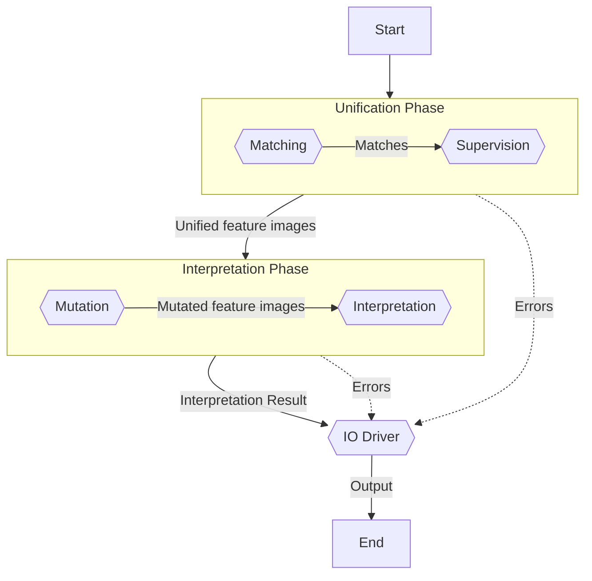

# Config

```yaml title="driver_license_ru.yml"
id: "example" # (1)!
name: "Example" # (2)!
source: "driver_license_ru.jpg" # (3)!
mutators: # (4)!
  source: # (5)!
  target: # (6)!
keypoints: # (7)!
  example_keypoint_name: # (8)! 
    x: 10 # (9)!
    y: 10 # (10)!
    w: 100 # (11)!
    h: 50 # (12)!
    matches: # (13)!
      min: 0 # (14)!
      max: 40 # (15)!
matching: # (16)!
  engine: sift_flann # (17)! 
  config: # (18)!
    sift_flann: # (19)!
      sensitivity: 0.7
supervision: # (20)!
  engine: combinatorial # (21)!
  config: # (22)!
    combinatorial:
      min_match_factor: 0.1
      max_transformation_error: 5
  result: best_score # (23)!
features: # (24)!
  example_feature_name: # (25)!
    x: 110 # (26)!
    y: 10 # (27)!
    w: 100 # (28)!
    h: 10 # (29)!
    class: example_feature_class # (30)!
feature_classes: # (31)!
  example_feature_class: # (32)!
    abstract: no # (33)!
    mutators: # (34)!
      - id: non_local_means_denoising # (35)!
        config: # (36)!
          colored: yes
    interpretation: # (37)!
      method: ocr_tesseract # (38)!
      config: # (39)!
        config: --dpi 10000 --oem 3 --psm 6
        lang: eng
```

1. This is the ID of the template. It is needed to identify this template in the API and must be alphanumeric and unique.
2. The name of the template, as should be displayed to the user.
3. This is the path to the example document you want to use as a base for the template. The path can be absolute or relative. If it is relative, then it will be resolved relative to the location of the current file.
4. A mutator is a size-preserving image transforming function. Examples of mutators include noise reduction and color correction.
5. A list of mutators that should be applied to the above template source image before the unification phase.
6. A list of mutators that should be applied to the input image before the unification phase.
7. A list of keypoints located in the template source image specified above. A keypoint is a rectangular region that should be present in all documents of this kind, and that should be used to find correspondences between the position of the given image and the positions in the template source image.
8. Example keypoint specification.
9. The x-coordinate of the top left corner of the rectangle (measured in pixels). Remember that the origin is located in the top left corner of the image. In other words, the x-axis points to the right, and the y-axis points down (not up!).
10. The y-coordinate of the top left corner of the rectangle (measured in pixels). Remember that the origin is located in the top left corner of the image. In other words, the x-axis points to the right, and the y-axis points down (not up!).
11. Width of the rectangle (measured in pixels).
12. Height of the rectangle (measured in pixels).
13. A match is a correspondence between a point in the template image and a point in the input image.
14. Minimum number of matches that should be identified within this keypoint's region when analyzing an image.
15. Maximum number of matches that should be identified within this keypoint's region when analyzing an image.
16. Matching is the process of finding equal patterns in the given image and the template source image, thus establishing correspondences between positions. Although better matchings will contribute to the accuracy of the document analysis, it is completely fine for a matching algorithm to err in some cases.
17. Here you can specify the name of the matching engine that should be used to find correspondences between positions of the given image and those of the template source image provided above.
18. Engine-specific configuration.
19. Configuration specific to the `sift_flann` matching engine.
20. Supervision is the process of unifying the given document image with the template source, based on the (partially unreliable) information received from the matching algorithm.
21. Here you can specify the name of the supervision engine that should be used to find correspondences between positions of the given image and those of the template source image provided above.
22. Engine-specific configuration.
23. Name of the strategy that should be used to compute the final supervision result.
24. A list of features located in the template source image specified above. A feature is a rectangular region containing any information of interest, such as text. In other words, the corresponding regions in the target image will be found during document analysis.
25. Example feature specification.
26. The x-coordinate of the top left corner of the rectangle (measured in pixels). Remember that the origin is located in the top left corner of the image. In other words, the x-axis points to the right, and the y-axis points down (not up!).
27. The y-coordinate of the top left corner of the rectangle (measured in pixels). Remember that the origin is located in the top left corner of the image. In other words, the x-axis points to the right, and the y-axis points down (not up!).
28. Width of the rectangle (measured in pixels).
29. Height of the rectangle (measured in pixels).
30. Optional, the class of this feature (see below).
31. A feature class can be used to group similar features together. Feature classes are identified by a unique name, and can inherit other classes.
32. For example, the following entry defines a feature class named `example_feature_class`.
33. Optional. By default, feature classes are not abstract. An abstract class cannot be directly used by any concrete feature, but can be incomplete. To use an abstract class, a non-abstract subclass has to be created. A non-abstract class can be used by concrete features, but cannot be incomplete.
34. A sequence of mutators that should be applied to the region of a feature before it is processed further.
35. Name of the mutator.
36. Optional mutator-specific configuration.
37. An interpretation method defines the way in which the mutated feature location should be processed further. For example, the `ocr_tesseract` method will apply the Tesseract OCR to the image.
38. Name of the interpretation method.
39. Intepretation-method-specific configuration values.