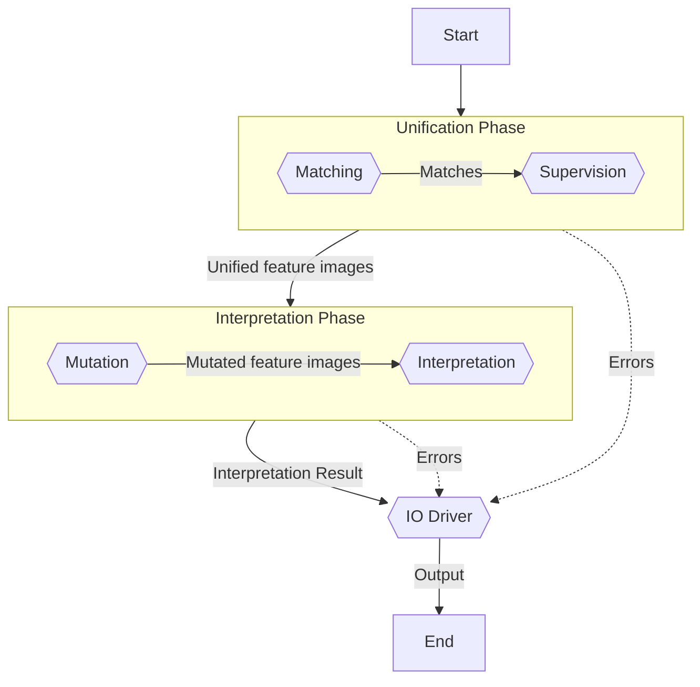

# Basic usage

A good introduction to OfficialEye would be to show how to re-create the example of the [home page](index.md). First, we need a high-quality image of an example document. For this tutorial, we shall use the following example of a German identity card:


Broadly speaking, we now need to explain OfficialEye, which parts of this example document contain information we are interested in, and which parts are present on any document of this kind and can be used to recognize the document on other images. OfficialEye uses a concept called *template* to conveniently capture in a single unit the example document together with this information. In this case, it makes sense to create a template called `German ID Card` and identifier `id_de`:

```bash
officialeye create demo/templates/id_de.yml --name "German ID Card" --id id_de --force
```

This command creates the configuration file `demo/templates/id_de.yml` for the new template, so that we don't have to configure everything from scratch.

<figure markdown>
  { width="600", loading=lazy }
  <figcaption>Driver's license example photo</figcaption>
</figure>

<div class="grid" markdown>
!!! tip "Template"
    * No further requirements

!!! example "Example document"
    * test
</div>